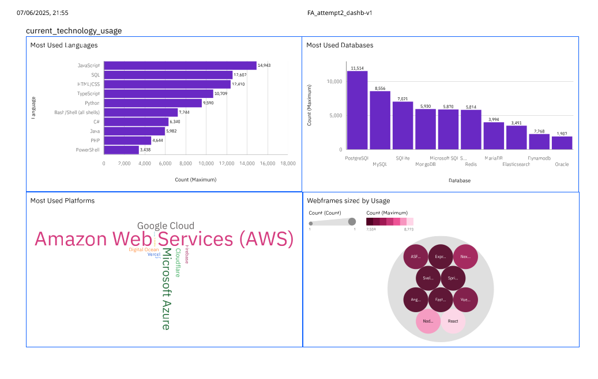

# IBM Data Analyst Capstone Project
## Developer Technology Preferences and Demographics Analysis


### 📊 Project Overview
This capstone project analyzes global developer technology preferences, demographics, and trends using Stack Overflow's annual developer survey data. The analysis provides strategic insights for technology adoption, talent acquisition, and workforce planning.

### 🎯 Key Objectives
- Identify current technology usage patterns among developers
- Understand future technology preferences and emerging trends  
- Analyze demographic distribution and educational backgrounds
- Provide actionable insights for technology strategy and workforce planning

### 📈 Key Findings
- **JavaScript dominates** with 14,943 responses, followed by Python (12,602) and HTML/CSS (12,410)
- **Strong shift toward cloud-native** and NoSQL database solutions
- **Global developer community** with diverse educational backgrounds
- **Performance and developer experience** increasingly drive technology choices

### 🛠️ Tools & Technologies Used
- **Data Visualization**: Google Looker Studio, IBM Cognos Analytics
- **Data Analysis**: CSV data processing and statistical analysis
- **Presentation**: Professional slide deck with executive summary

### 📊 Dashboard Links
- [**Google Looker Studio Dashboard**](https://lookerstudio.google.com/reporting/aa255d66-f2d3-431a-a0bc-a30480b18bc0) - Interactive visualizations
- [**IBM Analytics Dashboard**](https://eu1.ca.analytics.ibm.com/bi/?perspective=dashboard&pathRef=.my_folders%2FFAcapstone%2B%25281%2529%2FFA_attempt2_dashb-v1&action=view&mode=dashboard&subView=model000001974b4ce3b0_00000002) - Advanced analytics

### 📁 Project Structure
```
├── data/                          # Raw and processed datasets│  
├── dashboards/                    # Dashboard screenshots and exports
├── presentation/                  # Final presentation materials
│   └── IBM-DA-Capstone-Presentation.pdf
└── documentation/                 # Additional project documentation
```

### 🎨 Visualizations Created
- **Bar Charts**: Programming language and database rankings
- **Treemaps**: Technology usage proportions (limited to top 10)
- **Hierarchy Bubble Charts**: Framework and platform relationships
- **Geographic Maps**: Global developer distribution
- **Word Clouds**: Technology prominence visualization

### 📋 Dashboard Features
**Tab 1: Current Technology Usage**
- Most used programming languages
- Database preferences
- Platform adoption patterns
- Web framework analysis

**Tab 2: Future Technology Trends** 
- Languages developers want to learn
- Emerging database preferences
- Platform growth trends
- Framework evolution

**Tab 3: Demographics Analysis**
- Age distribution of developers
- Geographic representation
- Education level breakdown
- Career progression insights

### 💼 Business Implications
- **Talent Strategy**: Predict future skill demands and talent availability
- **Technology Investment**: Balance current productivity with future innovation
- **Training Programs**: Develop curricula bridging current and emerging technologies  
- **Market Positioning**: Align technology choices with developer preferences

### 🔍 Methodology
1. **Data Source**: Stack Overflow Annual Developer Survey
2. **Analysis Framework**: Multi-dimensional analysis covering usage, preferences, and demographics
3. **Visualization Strategy**: Strategic chart selection optimized for data comprehension
4. **Dashboard Design**: Three-tier analytical approach for comprehensive insights

### 📊 Key Metrics Analyzed
- **49 Programming Languages** analyzed for current usage and future interest
- **Multiple Database Technologies** compared for adoption trends
- **Platform Preferences** across web, mobile, and cloud environments
- **Global Demographics** including age, education, and geographic distribution

### 🎓 Skills Demonstrated
- **Data Analysis & Interpretation**
- **Business Intelligence Dashboard Creation**
- **Statistical Analysis and Trend Identification**
- **Professional Presentation Design**
- **Strategic Insight Development**
- **Multi-Platform Visualization Tools**

- Snippet from dashboard:
.

### 📧 Contact
**Kon Mez** - [kmezin@yahoo.com]
**LinkedIn** - [www.linkedin.com/in/kon-mez-8425ab2b3](https://linkedin.com/in/kon-mez-8425ab2b3)

**Project Link** - [https://github.com/konmez/IBM_data_analyst_capstone](https://github.com/konmez/IBM_data_analyst_capstone)

---
*This project was completed as part of the IBM Data Analyst Professional Certificate program.*

completed:
https://coursera.org/share/26d2545d5cb3a95e143150582a7872e7
